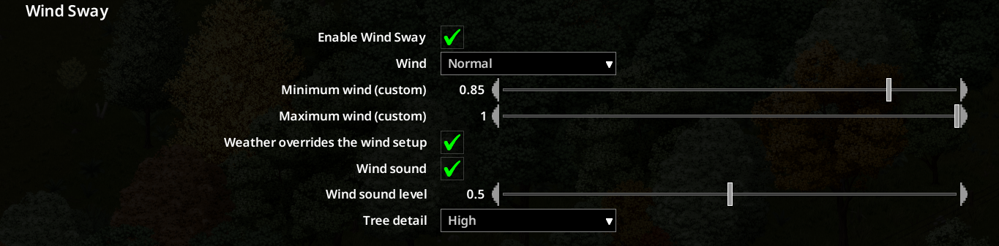

# Wind Sway

Trees, grass and bushes sway with the wind, from light breeze to storm.

Vanilla's "Wind Sprite Effects" (off by default) shears sprites between random poses; trees only join in above a wind threshold, the big ones barely at all, and on calm days nothing moves for hours. Wind Sway replaces the animation and the renderer:

- **Trees bend** from the trunk up, the trunk stays put. Leaves flutter, broad crowns move as a block, evergreens as a stiff cone. Scaled to tree size, jumbos included.
- **Wind has a direction and gusts**: crowns lean with the rain, gusts roll through the forest, storms bend crowns over and hold them. No random poses, no twitching.
- **Sway in still air**: two sliders, plants and trees. Weather adds on top.
- **Every plant moves**: bushes and all wind plants, stiffer ones a little less. Nothing waits for a wind threshold.
- **Render-only**: water, sounds and aiming stay on the real weather.
- **Batched**: grass in a few draw calls, trees in one batch per list instead of one draw per tree. Cheaper than vanilla's wind option, tree-heavy areas run faster than vanilla (on my machine).

Options → Mods → Wind Sway. No other setup.

[](https://www.youtube.com/watch?v=zXTunrHDK6w)

## Maintenance status

Work in progress: I keep optimizing the renderer as time allows. Last tested against PZ build 42.20.3.

Source is MIT-licensed. Forks and improvements are welcome and encouraged.

## Requirements

- **Project Zomboid** Build 42.20 or newer
- **[ZombieBuddy](https://steamcommunity.com/sharedfiles/filedetails/?id=3619862853)**: Java bytecode patching framework (required, one-time setup)

## Installation

1. Subscribe to **[ZombieBuddy](https://steamcommunity.com/sharedfiles/filedetails/?id=3619862853)** on the Steam Workshop and follow its one-time setup instructions. This step is only needed once: all mods that depend on ZombieBuddy work automatically afterwards.
2. Subscribe to **[Wind Sway](https://steamcommunity.com/sharedfiles/filedetails/?id=3782670683)**.
3. Enable both mods in the in-game mod list and launch the game.

Because Wind Sway ships a Java JAR, the **first** time you launch the game after installing it, ZombieBuddy will show a native approval dialog with the mod name and an `updated` date. Tick `Allow` to approve this specific JAR. A persist-decision checkbox at the bottom saves your choice for future updates.

No other setup: Wind Sway switches the game's wind path on by itself and ignores the vanilla "Wind Sprite Effects" option while it runs. Turn the mod off and the game follows your vanilla setting again.

## Compatibility

- Safe to add or remove mid-save: no save data touched.
- Works well with [Peek a View](https://steamcommunity.com/sharedfiles/filedetails/?id=3710281407), my wall cutaway / tree fade / stair view mod.
- Not compatible with the original Wind Tree Sway mod (declared incompatible in `mod.info`; both drive the same wind path).

## Multiplayer / dedicated servers

Wind Sway is client-side: the server runs none of its code, each player only sees the effect on their own screen. Two things still have to be in place:

- **On the server**: both mods go into the server's `.ini`, so joining clients download and enable them (keep your other entries, separate with semicolons; `3619862853` = ZombieBuddy, `3782670683` = Wind Sway):

  ```ini
  Mods=ZombieBuddy;WindSway
  WorkshopItems=3619862853;3782670683
  ```

- **On every player's PC**: ZombieBuddy's one-time setup (its installer puts the Java agent into the game folder). The server can't do that part for you. Without it, Options → Mods → Wind Sway shows a warning that the Java part did not load, and nothing sways.

The first time Wind Sway loads on a PC, ZombieBuddy asks for approval of the mod's JAR, tick Allow.

## Settings

Everything sits under Options → Mods → Wind Sway.



| Setting | Range / Default | What it does |
|---|---|---|
| Enable Wind Sway | on | Master switch. While on, the mod drives the game's wind path and draws swaying vegetation with its own batched renderer. |
| Minimum sway (plants) | 0–0.5, default 0.1 | Sway in still air. Wind adds on top. 0 = vanilla wind only. |
| Minimum sway (trees) | 0–0.5, default 0.1 | Same for tree crowns. 0 = vanilla wind only. |

## FAQ

**What does it cost in FPS?**
Some. Anything that moves is drawn every frame. Wind Sway batches it (see above), which stays well below the vanilla wind path; tree-heavy areas even run faster than vanilla on my machine.

**Do I need to enable "Wind Sprite Effects" in Display & Performance?**
No. While Wind Sway is on it drives the game's wind path itself and ignores that option, the mod's master switch is the only one that matters.

**Does it work in multiplayer?**
Yes, client-side only. See [Multiplayer / dedicated servers](#multiplayer--dedicated-servers) for the server `.ini` entries and the per-player ZombieBuddy setup.

## Building from Source

One-time setup:

1. Copy `build.local.example` to `build.local` and set `PZ_DIR` to your PZ install (and `JDK_DIR` if your JDK is elsewhere).
2. Ensure `ZombieBuddy.jar` sits next to `projectzomboid.jar` in your PZ install.

Then `./build.sh` compiles, packages `windsway.jar`, and installs to `%USERPROFILE%/Zomboid/mods/WindSway`. PZ must be closed during build (the script aborts otherwise).

## Links

- **GitHub:** https://github.com/armakupub/WindSway
- **Steam Workshop:** https://steamcommunity.com/sharedfiles/filedetails/?id=3782670683
- **Teaser video:** https://www.youtube.com/watch?v=zXTunrHDK6w

## Attribution

The idea comes from [Wind Tree Sway](https://steamcommunity.com/sharedfiles/filedetails/?id=3775279084) by Waizee. Wind Sway is an independent implementation with its own shader and batched renderer, and it fixes the side effects of the original approach: raising the wind through the global climate value also sped up the water animation, shifted the ambient wind sound and added a permanent outdoor aim penalty. Wind Sway raises only the value the vegetation sway reads.

## License

MIT, see `LICENSE`.
